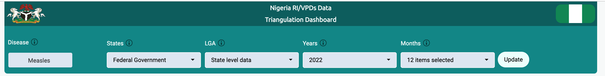

<!-- README.md is generated from README.Rmd. Please edit that file -->

```{r, include = FALSE}
knitr::opts_chunk$set(
  collapse = TRUE,
  comment = "#>",
  fig.path = "man/figures/README-",
  out.width = "100%"
)
```


# Data Triangulation Dashboard


<!-- badges: start -->
[](https://lifecycle.r-lib.org/articles/stages.html#experimental)
[](https://github.com/afenetgeeks/DataTriangulationStream2/actions)
<!-- badges: end -->


## Overview 

The goal of data triangulation project is to conduct a Data triangulation exercise that will turn Nigeria Routine Immunization And Vaccine Preventable Diseases Surveillance datasets into interactive dashboards.


## Description

The `Nigeria Routine Immunization (RI) & Vaccine Preventable Diseases Surveillance (VPDs)` Data Triangulation Dashboard visualizes selected indicators across `RI & VPDs` programme.

The dashboard is be integrated with the country's `DHIS2 national instance (FMoH)`, `Surveillance Outbreak Response Management and Analysis System (SORMAS) (NCDC)`, and the `Multi-Source Data Analytics and Triangulation (MSDAT) (FMoH)` Platform.

The updates on the dashboard will still be controlled by the `AFENET geeks` team.

The servers and database powering the dashboard are independent of the three platforms hence in case any of them is down for any reason you can still access the dashboard from the alternative system or contact the AFENET team.


The dashboard provides access to timely information (data updated on monthly basis) required for decision making at the national and sub-national levels.

## How to use the dashboard

Use the filters at the top of dashboard that is to say, you can select the `Disease`, `State`, `LGA`, `year`, `month` that suits your needs and then press `UPDATE`.




***Note: The maps have separate filters in their own panels***

## Quick note about the maps

The boundaries and names shown and the designations used on this map do not imply the expression of any opinion whatsoever on the part of the `AFENET GEEKs` concerning the legal status of any country, territory, city or area or of its authorities, or concerning the delimitation of its frontiers or boundaries. Dotted and dashed lines on maps represent approximate border lines for which there may not yet be full agreement.
