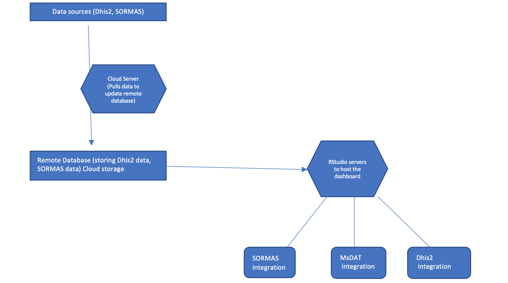

```{r, include = FALSE}
knitr::opts_chunk$set(
  collapse = TRUE,
  comment = "#>",
  echo = F
)

options(rmarkdown.html_vignette.check_title = FALSE)
```

```{r setup}
#library(DataTriangulationStream2)
```

### Who should read this

If you are an End user and want to get a glimpse of how the whole system works and the system's building blocks.

### How everything connects

The end product **(the dashboard)** has several systems that make it fast and reliable even when the primary data sources (Dhis2 or SORMAS) are down. 

**Below is a figure to illustrate how the whole system works, starting from the data sources to the final integrated systems** 

```{r whole-system,fig.cap = "The whole system",  out.width = '90%'}

```


```{r key-of-whole-system,fig.cap = "The key of the whole system", out.width = '90%'}
knitr::include_graphics("figures/key-of-whole-system.png")
```


**The whole system is made up of the:**

### 1.	Data sources

The data sources used for this project are:

-	DHIS2 National instance
-	SORMAS (NCDC)

**NOTE:** Data which identifies the individual client is **NOT** used at any level of the dashboard; the case ID, e.g. "TGDW5P", is used to identify the row in the database

-	Other sources available as CSV files for the alternative denominator 


### 2.	Remote database 

***This stores Dhis2 data, SORMAS data, other csv files data***

The remote database is a cloud-based SQL database aimed to store the combined data from Dhis2 and SORMAS to provide high scalability and reliability of the dashboard even if one of the data sources is down.

#### 2 i). Anto-update database cloud server 

***Pulls data to update remote database***

This cloud server automatically pulls the data from `DHIS2` and combines it with `SORMAS` data and  `alternative denominator` data and then updates the remote Database. This is done monthly


### 3.	Servers that are hosting the dashboard.

The servers hosting and providing computing power to the dashboard differ from the integrated systems (DHIS2 and SORMAS) servers. This means that speed and availability of the dashboard are independent of them.


### 4.	Integration without systems 

Since the dashboard is a web-based technology, it allows us to integrate with most of the already existing systems, i.e. `DHIS2`, `SORMAS`, and `MSDAT`, since they are also web-based technologies.


